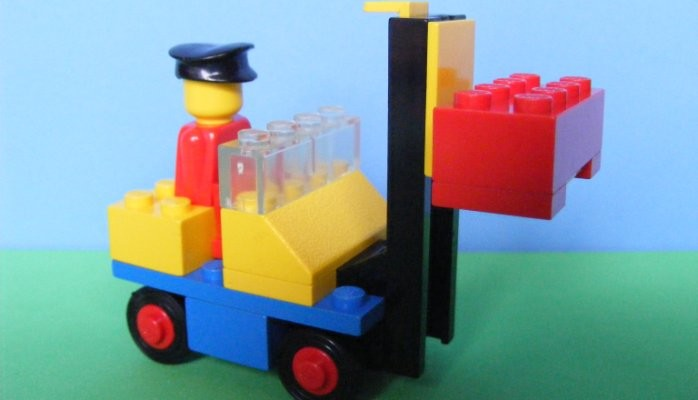
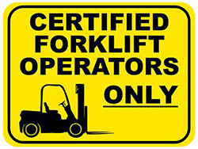
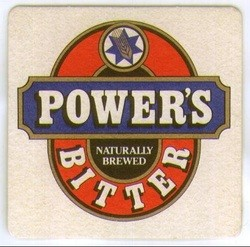
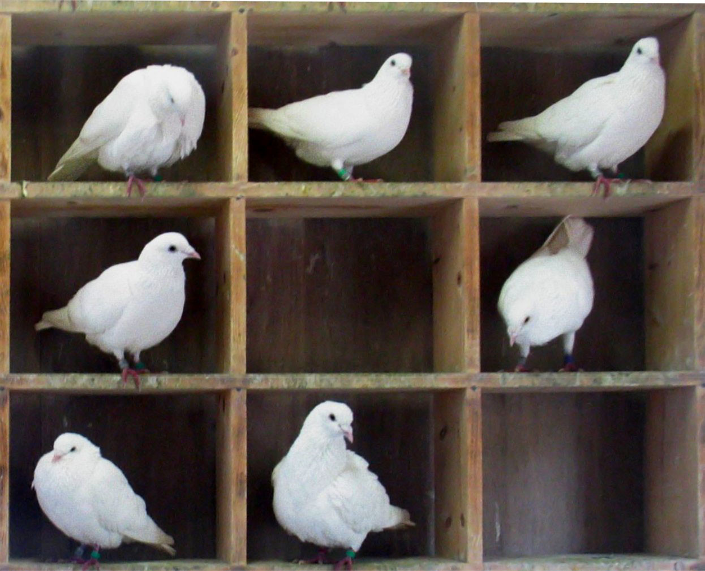

# Everyone has a forklift license
10-April-2015

I once heard a great story about a leader at a new brewery in Yatala.
As the brewery and business grew, they found they had more capacity to make and deliver beer using their truck network, eventually going from nothing to `10% of the market`.

However they hadn't catered for an important bottlekneck... 
...getting the beer onto the trucks. So one day when the forklift driver was sick - no beer could be delivered. What happened next I have since referred to as `Power's Brewing Model`. The leader (possibly `Bernie Power` himself) decided that everyone at the brewery would have a forklift license so this would never happen again. 

?>Now owned by CUB [Yatala brewery still powering along](http://www.brewsnews.com.au/2010/01/yatala-brewery-still-powering-along/)

## How does this apply to teams ?

Since first hearing this story I have re-told this approach many times to colleagues on my team. Often resulting in jokes about creating a official `forklift license` certificate. So what does it mean to your teams ? 

I think everybody should be *allowed* and *encouraged* to explore skills outside their speciality. In the software team I work with this includes Testing, Business Analysis, Project Management, Software Development on the web, iOS and Android devices. 

## What? I should write software ?

*Yes*. Why not? You have a team beside you who knows how and you are meant to regularly empathise with the work they are doing.

## Huh. I should do Business Analysis?

*Sure*. It is kind of important to understand the *why* behind decisions to try new stategies or experiments.

## I'm not a tester (breaker) I am a developer (maker)

There is no doubt the speciality of testing is more about breaking then making, but to walk a mile in this space helps think more clearly when making. Imagine for a moment that your customers are not going the use the software the way you do. Maybe they like hashtags for their credit card name. Who knows? Can't hurt to understand how to test.

## What about efficiencies ?

There is no doubt that someone new to a speciality is unlikely to be as efficient as a veteran to the area. But as described in the Power's brewing story - the true measure of any task is *throughput* - how quickly can you get the beer to the market. It doesnt matter how fast the trucks go, or the beer is made if it can't be loaded. 

## What to take away

Give it a try in your team. The *human condition* tends to make us all a little inquisitive and interested in a challenge even if only to make the day more interesting. You will be pleasantly surprised in the value your team can bring by venturing outside the shoebox of your job description. 

Related post [The full-stack employee](https://medium.com/@chrismessina/the-full-stack-employee-ed0db089f0a1)

