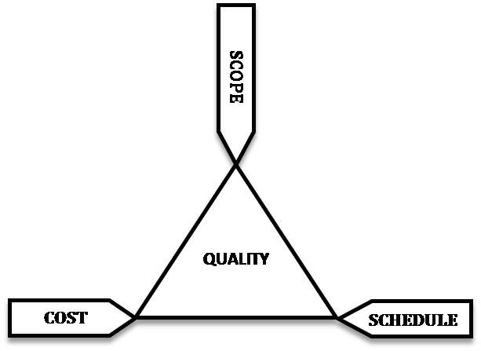

# The 8-mile effect
25-April-2015

Developing software has a fair share of challenges. Choosing the right tools, the right platform, the build pipeline, unit testing, stress testing, security...

But none of these compare to the challenge that emerges when choosing the `right` features to do first. 

Over the last decade I have worked with various internal and external stakeholders and one thing that seems to get in the way of choosing the `right` features is best expressed by Eminem's performance in the movie [8-mile](https://youtu.be/axGVrfwm9L4?t=53)

> ... Look, if you had one shot, or one opportunity
> To seize everything you ever wanted. one moment
> Would you capture it or just let it slip...
 
Everybody wants `their` feature included, because otherwise it won't get another chance.

The interesting side effect of this is the followup water cooler conversation about how software projects are never:

 * delivered on **time**,
 * to a **satisfactory level of completion**, 
 * have the infamous **phase 2** where the rest of the features get delivered. 

Sound familiar ?

But do these kinds of comments help fuel the challenges in the first place?

Let's explore each:

### Delivered on time

So the project is late..."this is why I have to keep adding more features into the first phase". Have you heard this one?

The [Iron Triangle](http://en.wikipedia.org/wiki/Project_management_triangle) of project management demonstrates that only two out of three constraints of cost, features(scope) and time(schedule) can be fixed. Or expressed in another way - a change to one of the items effects the other two. 

So given time is fixed and features are being added, cost will increase. For fixed budget software development this is not an option so ultimately time is impacted. 

It's not so strange now how constantly trying to resolve lateness by adding more into a phase is actually counter-productive and makes the problem worse. 

### A satisfactory level of completion

Why are we always unhappy with the result?

The drive to ensure features are included in software leads to two side effects. 

 1. Extended **analysis** and **design** lead time leading to analysis paralysis and/or arbitrary trade-offs. Mostly based on what can be completed the quickest. 
 2. Late and incremental addition of features to a constrained design. An effect similar to the way wires are run in the picture below. 

 
 
Is this what happens with your projects? Both of the side effects lead to results that aren't considered satisfactory when software ships. But ask most engineers or designers and words like *scope creep* and not sticking to the *design* is the first thing sighted. 

### The infamous Phase 2

The folklore built upon the idea that *there is no phase 2* has only helped put more pressure on the first phase of software development. Harvard business review writer Jeff Gothelf delves into this in his article - [The Biggest Lie in Corporate America Is Phase 2](https://hbr.org/2012/05/the-biggest-lie-in-corporate-a)

Jeff explains:

> Phase 2 is typically the mythical future world where those “things we didn’t get to” in Phase 1 go to die. Few members of the team are harder hit by this reality than the user experience and design staff...

He goes further to point out:
>  ...the design team is trained over time to believe that if a feature doesn’t get into Phase 1, it will not get built...

One shot? One opportunity ? Sounds familiar. But not all hope is lost. 

## What can we do ?

Lucky for us, this problem is not new and there have been pioneers trialling different approaches from as far back as [1957](http://en.wikipedia.org/wiki/Agile_software_development#History).

The success of these methods went mainstream when Toyota's dominance was attributed to their process - the [Toyota Production System](http://en.wikipedia.org/wiki/Toyota_Production_System).
This continues to drive a popular movement around iterative development and lean methodology.  

Having an effective production system is not enough by itself to counter the *8-mile effect* as we still need to choose the right features. Luckily the work of Eli Goldratt and his [Theory of Constraints (TOC)](http://en.wikipedia.org/wiki/Theory_of_constraints) has found some following after the success of his business novel [The Goal](http://bit.ly/1yYUsdE). As quoted on the book's cover this is "required reading for Amazon's management". 

So how do each of these tools help us on our journey to combat the *8-mile effect*. 

### Iterative Development

Iterative development gets us started by incorporating a strong feedback loop to help us decide which features really matter. As usable artefacts are created with chosen features, information is collected through quantitative (eg. digital analytics) and qualitative (eg. user testing, focus groups, surveys) methods. 

On the qualitative side, Stephen Krug's book [Dont make me think](https://www.sensible.com/dmmt.html) covers a lot of information around how customers prefer *mindless choices* to help solve their problems. He also encourages the use of simple user testing to help provide feedback as soon as possible. 

Attaining actual numbers on customer behaviour now a prerequisite for websites and applications. Tools like [Google Analytics](http://www.google.com/analytics/) have made this process simple and straight forward with rich real-time graphing and the ability to run A/B tests. 

By validating feature choices made in each iteration  **gut** decisions or forecasted outcomes can be validated or priorities can be changed for the next iteration. Failing fast in an iteration can help ensure the overall software project can learn early and take a alternative course and still achieve its goal.

### Lean Methodology

Taking the feedback idea further, the popular book [the lean startup](http://theleanstartup.com/book) by Eric Ries has taken the concept of choosing features back to its entrepreneurial roots. Eric promotes the idea of clearly establishing the problem and then choosing a [Minimum Viable Product (MVP)](http://theleanstartup.com/principles). The MVP begins the process of **learning** if the product and specific features provide a useful solution. 

With the Build-test-learn process of lean focusing on the smallest experiment one can conduct to learn something - each iteration of development can have small wins on the path to final delivery.

### Focus and the theory of constraints

But choosing items and random on **gut feel** hasn't always worked out. Eli Goldratt in his popular business novel [The Goal](http://bit.ly/1yYUsdE) presents the idea that problem solving should NOT focus on local optimisation but consider the entire workflow ie. target the bottlenecks in the workflow. In his other presentations he concentrates this concept in a decision making process he names the [Theory of Constraints (TOC)](http://en.wikipedia.org/wiki/Theory_of_constraints). With the tools he provides it is possible to take a large set of data and intuitive insights(i.e. **gut feel**) and produce a set of prioritised steps to lead to a goal. For choosing features to learn from first - these tools can work well for individuals and teams trying to get started or to make ongoing decisions. 

Assuming the goal of a system has been articulated and its measurements defined, the steps are:

1. Identify the system's constraint(s).
2. Decide how to exploit the system's constraint(s).
3. Subordinate everything else to the above decision(s).
4. Elevate the system's constraint(s).
5. Warning! If in the previous steps a constraint has been broken, go back to step 1, but do not allow inertia to cause a system's constraint.

## Closing thoughts

Developing software will present you with the *8-mile effect*. Peers and stakeholders will want to add their ideas and features to your software and you will need to make decisions involving tradeoffs. You will also encounter your own fear of missing the opportunity to get that crucial item into the next release. But thanks to our pioneers there are tools to help. 

With Lean-MVP and TOC you are in a better place to choose and prioritise features based on a clear understanding of the problem and the learning process to provide the most useful software. You are also well equipped to make everyone aware of the core problem that is being solved.

In the words of my peer and successful entrepreneur behind [60Hz](http://m2d2apps.com/60hz-for-ios7/) - [Dineth Mendis](http://dinethmendis.com). 
> Lean's great because the experiment is revolving around the problem, and in a rather unselfish, empathetic way of helping the customer.

So get on the journey and keep having fun!

